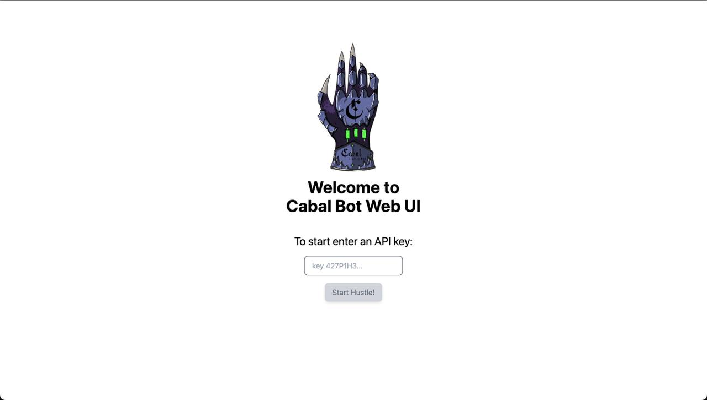
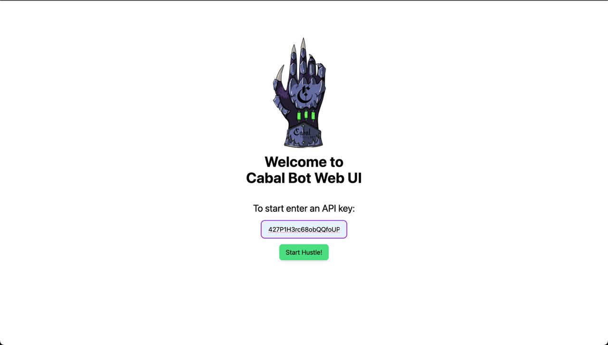
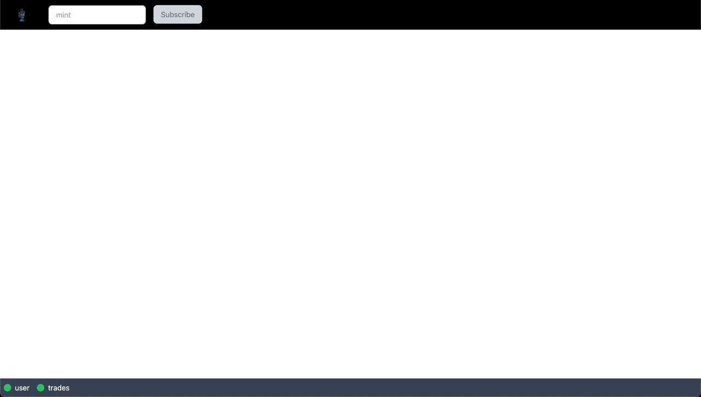
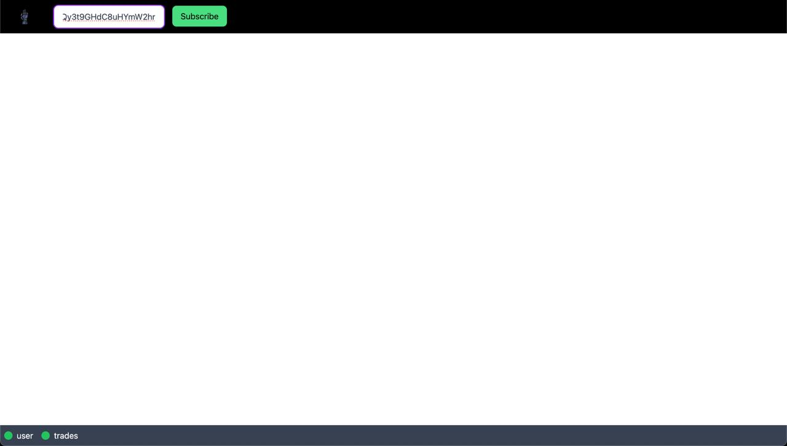
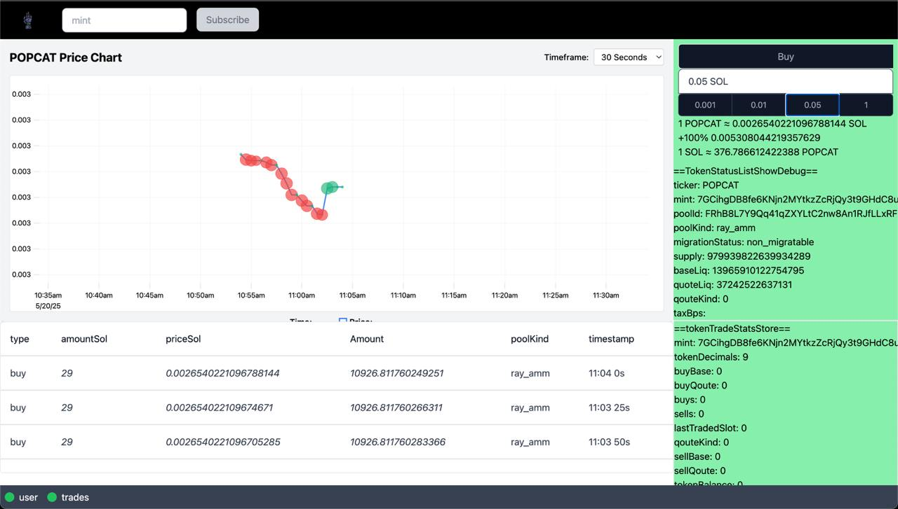
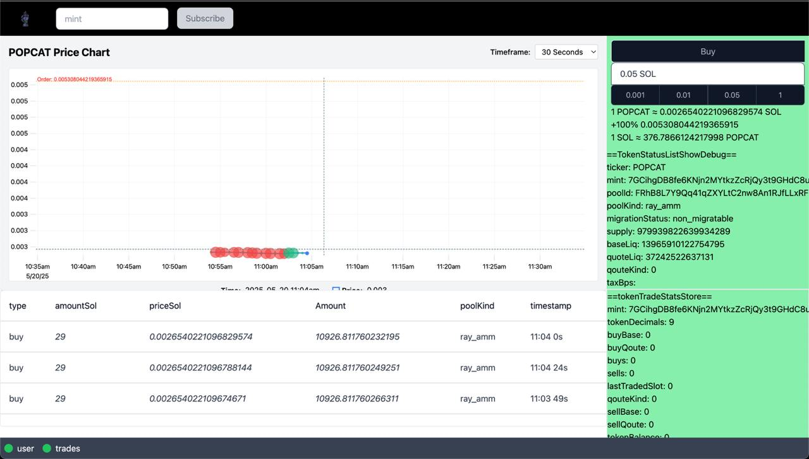

# Cabal Bot Web UI

## Launching the application

```
npm i
npm run dev
```

Enter an api key from cabal bot, instructions:
https://cabalbot.ai
https://cabalbot-1.gitbook.io/cabalbot-docs
telegram @CabalSolana_bot




connecting to bot:



enter mint, i used POPCAT/SOL

POPCAT

7GCihgDB8fe6KNjn2MYtkzZcRjQy3t9GHdC8uHYmW2hr



wait for trades



set order



TODO:

- deposit to wallet
- place differents orders
- remove orders
- formatting info
- charting via trading view
- collet token info
- history trades
- docs
- tests
- add backend

## techs

### gRPC

Used gRPC Typescript binding of CABAL BOT
https://github.com/otmjka/CabalSolanaBotTypescript

`@connect-es`

# Frontend

`Solidjs`, `uPlot`

## styles

```
tailwindcss@3
tailwind.config.js
src/index.css
```

```
CabalService

start
  call connect to `UserActivityUni`
  broadcast message `userActivityConnected`
  call `UserPing` (this.pingUser)
  listen events (this.listenUserActivity)

```

---depends of ApiKey
start of CabalService
CabalService emit messages

useCabalService
proxy(broker'ing) all messages to stores

`tradeEventStore` -
on `CabalTradeStreamMessages.tradeEvent`
TradeEvent -> TradeRecord

```ts
type TradesStore = {
  trades: TradeRecord[];
};
```

Subscribers:

Chart
TradesHistory
=> currentPrice

## Data Stores

tradeEventsStore
